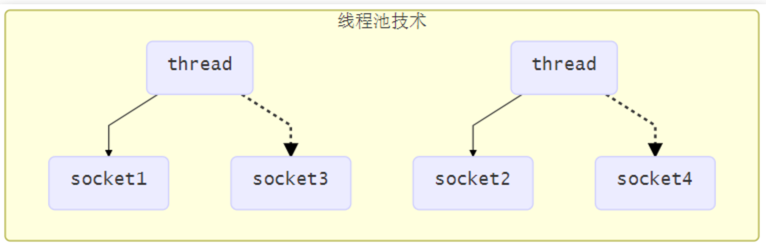
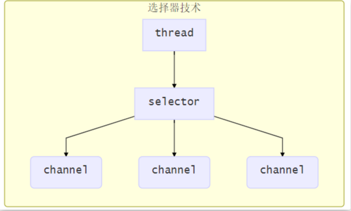

# Netty学习笔记
## 1、基础
### 三大组件介绍

#### 1、 Channel（负责传输）与Buffer（负责存储）

Java NIO系统的核心在于：通道(Channel)和缓冲区(Buffer)。通道表示打开到 IO 设备(例如：文件、套接字)的连接。若需要使用 NIO 系统，需要获取用于连接 IO 设备的通道以及用于容纳数据的缓冲区。然后操作缓冲区，对数据进行处理。

常见的四种Channel：

- FileChannel（文件传输）

---------
网络通信Channel
- DatagramChannel
- SocketChannel
- ServerSocketChannel

Buffer有以下几种:

- ByteBuffer（常用）
  - MappedByteBuffer
  - DirectByteBuffer
  - HeapByteBuffer
- ShortBuffer
- IntBuffer
- LongBuffer
- FloatBuffer
- DoubleBuffer
- CharBuffer

#### 2、selector

池化技术（多线程）带来的弊端：
+ 一个线程只能处理一个连接、适合短连接，长连接过多导致阻塞
+ 线程切换上下文费时间

选择器的优势：
一个线程管理多个channel，channel工作在非阻塞模式下，当channel没有执行任务的时候，可以切换到其他channel。
**适合连接数多，流量少的场景。**

